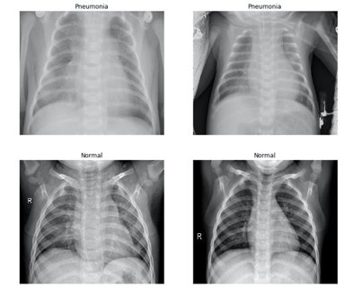

# Pneumonia-Detection
It's the final project of the Masters' course "Intro to Computer Vision" at [Skoltech University](https://www.skoltech.ru/en/)

## Team Members
- Alsu Vakhitova
- Batyrkhan Gainitdinov
- Mohammed Deifallah

## Problem Statement
Pneumonia detection on chest X-ray images.

## Data
Dataset, we worked on, is available on [Kaggle](https://www.kaggle.com/paultimothymooney/chest-xray-pneumonia).

Here are some samples:

We also have additional images for Pneumonia from the personal archive by prof. Gainitdinova Viliya Vilevna at [Sechenov university](https://www.sechenov.ru/eng/)

## Algorithms & Techniques
- Data Augmentation
- Feature Extraction
    - Histogram of Gradients (HoG)
    - Local Binary Pattern (LBP)
- Classification
    - Support Vector Machine (SVM)
